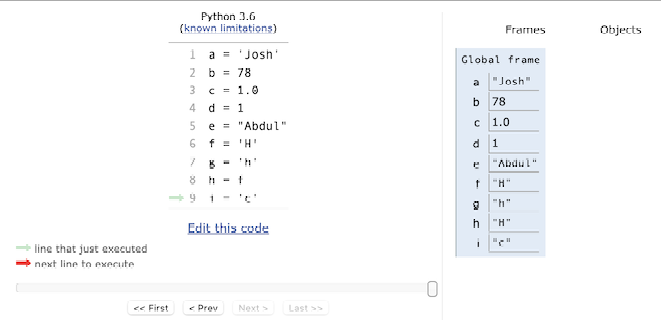
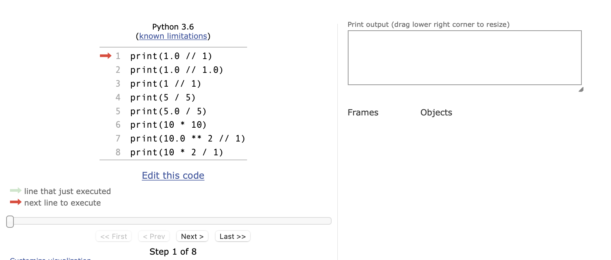
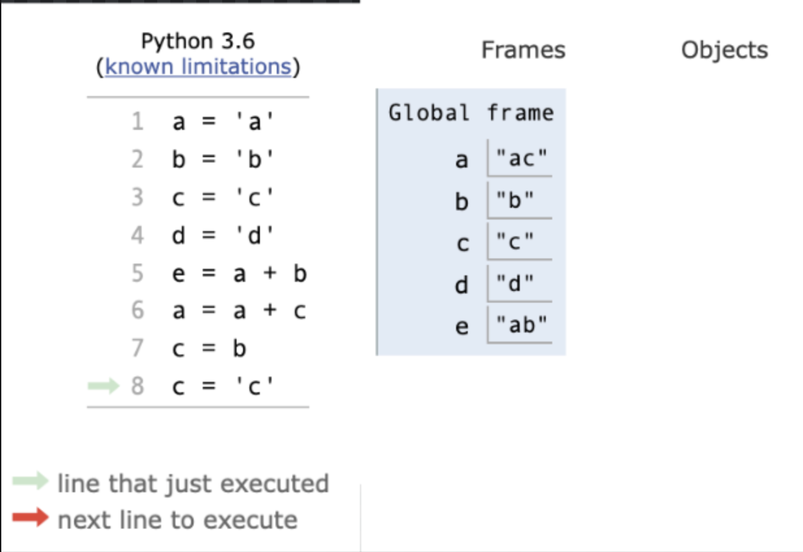

..  Copyright (C)  Brad Miller, David Ranum, Jeffrey Elkner, Peter Wentworth, Allen B. Downey, Chris
    Meyers, and Dario Mitchell.  Permission is granted to copy, distribute
    and/or modify this document under the terms of the GNU Free Documentation
    License, Version 1.3 or any later version published by the Free Software
    Foundation; with Invariant Sections being Forward, Prefaces, and
    Contributor List, no Front-Cover Texts, and no Back-Cover Texts.  A copy of
    the license is included in the section entitled "GNU Free Documentation
    License".

.. qnum::
   :prefix: 2-18-
   :start: 1

Chapter 2 Assessment
--------------------

**Check your understanding**

.. activecode:: assess_Ch2_01
    :include: assess_addl_functions
    :language: python
    :autograde: unittest
    :topics: SimplePythonData/FunctionCalls

    There is a function we are providing in for you in this problem called ``square``. It takes one integer and returns the square of that integer value. Write code to assign a variable called ``xyz`` the value ``5*5`` (five squared). Use the square function, rather than just multiplying with ``*``.
    ~~~~
    xyz = ""

    =====

    from unittest.gui import TestCaseGui

    class myTests(TestCaseGui):

        def testOne(self):
            self.assertEqual(type(xyz), type(3), "Checking type of xyz")
            self.assertEqual(xyz, 25, "Checking if xyz is 25")
            self.assertIn('square', self.getEditorText(), "Testing that 'square' is in your code. (Don't worry about Actual and Expected Values.)")

    myTests().main()

.. activecode:: assess_Ch2_02
    :language: python
    :autograde: unittest
    :practice: T
    :topics: SimplePythonData/StatementsandExpressions

    Write code to assign the number of *characters* in the string ``rv`` to a variable ``num_chars``.
    ~~~~
    rv = """Once upon a midnight dreary, while I pondered, weak and weary,
        Over many a quaint and curious volume of forgotten lore,
        While I nodded, nearly napping, suddenly there came a tapping,
        As of some one gently rapping, rapping at my chamber door.
        'Tis some visitor, I muttered, tapping at my chamber door;
        Only this and nothing more."""

    # Write your code here!

    =====

    from unittest.gui import TestCaseGui

    class myTests(TestCaseGui):

        def testOne(self):
           self.assertEqual(num_chars, len(rv), "Testing that num_chars has been set to the length of rv")

    myTests().main()

.. mchoice:: assess_Ch2_03
   :multiple_answers:
   :answer_a: a = len("hello worldwelcome!")
   :answer_b: a = 11 + 8
   :answer_c: a = len(z) + len(y)
   :answer_d: a = len("hello world") + len("welcome!")
   :answer_e: none of the above are hardcoding.
   :feedback_a: Though we are using the len function here, we are hardcoding what len should return the length of. We are not referencing z or y.
   :feedback_b: This is hardcoding, we are writing in the value without referencing z or y.
   :feedback_c: This is not considered hard coding. We are using the function len to determine the length of what is stored in z and y, which is a correct way to approach this problem.
   :feedback_d: Though we are using the len function here, we are hardcoding what len should return the length of each time we call len. We are not referencing z or y.
   :feedback_e: At least one of these solutions is considered hardcoding. Take another look.
   :correct: a,b,d
   :practice: T
   :topics: SimplePythonData/StatementsandExpressions

   The code below initializes two variables, ``z`` and ``y``. We want to assign the total number of characters in ``z`` and in ``y`` to the variable ``a``. Which of the following solutions, if any, would be considered hard coding?

   .. sourcecode:: python

    z = "hello world"
    y = "welcome!"

.. activecode:: assess_Ch2_addl_functions
    :language: python
    :nopre:
    :hidecode:

    (This is not an assessment question) The code below defines functions used by one of the questions above. Do not modify the code, but feel free to take a look.

    ~~~~

    def square(num):
        return num**2

.. fillintheblank:: assess_Ch2_cdq1

   Which variables in the image above are assigned string values?
   List each *variable* in the box below, separated by a white space.

   -    :a e f g h i:   Correct. You typically use whole numbers for ages after age 1.
        :.*:    There are 6 in total, can you find them all? Remember that variables are case sensitive.

.. fillintheblank:: assess_Ch2_cdq2

   Which line number(s) will print an integer as the result of the given operation?
   List each one in the box below, separated by a white space.

   -    :3 6:      Correct! All the others either use floats or integers with the '/' operation which always returns a float.

        :.*:     Not quite. Try it out yourself to check your understanding of '/' and '//'. Make sure you format your answer as numbers separated by spaces as well.

.. fillintheblank:: assess_Ch2_cdq3

   The image above shows a program that just completed executing (we know this because the green arrow is on the last line and there is no red arrow in the image). At the end of the program, which variables changed from their original value during the program's execution?
   List each *variable* in the box below, separated by a white space.

   -    :a c:      Correct! Even though c finished with the same value it started with, it still was updated during the code execution.
        :a c e:     Not quite. Variable e is made up of values from a and b but it never gets reassigned.
        :a e:       Not quite. Variable e is made up of values from a and b but it never gets reassigned. Read through the program again to double check which variables get new values during code execution.
        :a:         Almost. Variable a is definitely reassigned during the program but is that the only one? Go back and read the code again to see if there is any others
        :.*:     Not quite. Read through the program again to see which variables are updated during the code execution.