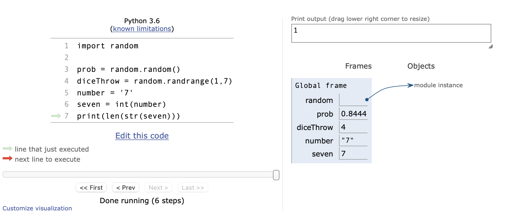
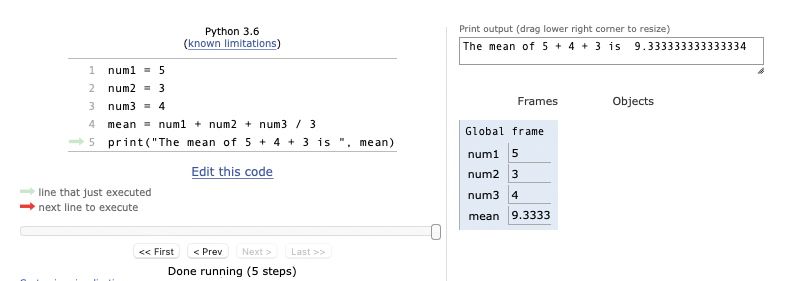
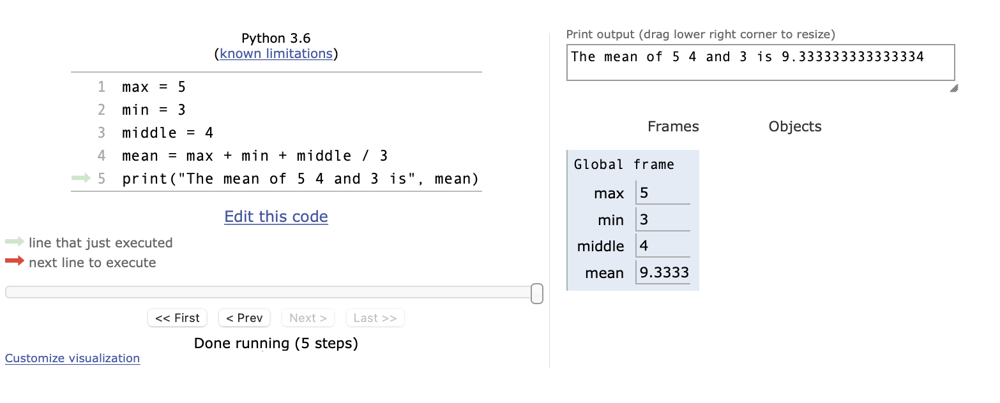

.. qnum::
   :prefix: debugmodule-cdq-
   :start: 1

.. Week 1 Assessment 3

Chapter Assessment - Debugging and Modules
------------------------------------------------

**Check your understanding**

.. mchoice:: mc_ch3_cdq1
   :answer_a: variables
   :answer_b: objects
   :answer_c: modules can be called as variables or modules
   :answer_d: none, they are their own unique label
   :correct: b
   :feedback_a: modules make use of lots of functions and variables but they are not variables themselves, do you see that arrow in the image?
   :feedback_b: Correct! The arrow in the screenshot tells us that a module is an object being referenced.
   :feedback_c: While we sometimes think of variables and objects in a similar fashion they aren't the same thing and modules definitely are not both.
   :feedback_d: Everything in Python has to be stored somewhere on a computer, even modules. This means modules have to be types of variables or objects.
   :practice: T

   Given the above screenshot of the CodeLens animation , we can say that modules (e.g random) are which of the following?

.. fillintheblank:: fib_ch3_cdq2

   Consider the above screenshot of the CodeLens animation. This code is supposed to calculate the mean (average) of the 3 numbers but there is a semantic error on which line number?

   -    :4: Correct! Order of operations comes into play here and we need some brackets. Try writing this code for yourself with the right brackets and see if you can get the correct mean (should be 4).
        :1: Semantic errors have to do with logic. This is assigning max a value. There is no logic happening here.
        :2: Semantic errors have to do with logic. This is assigning min a value. There is no logic happening here.
        :3: Semantic errors have to do with logic. This is assigning middle a value. There is no logic happening here.
        :5: Semantic errors have to do with logic. This is printing the calculated value. There is no logic happening here.

.. fillintheblank:: fib_ch3_cdq3
   :casei:

   Fill in the blanks to describe how you would fix this error.

   This type error can be solved by |blank| one of the variables to a(n) |blank|.

   -   :casting|converting: Correct.
       :.*: Incorrect. Try 'red'.
   -   :int|string: Correct.
       :.*: Incorrect. Try 'away'.

