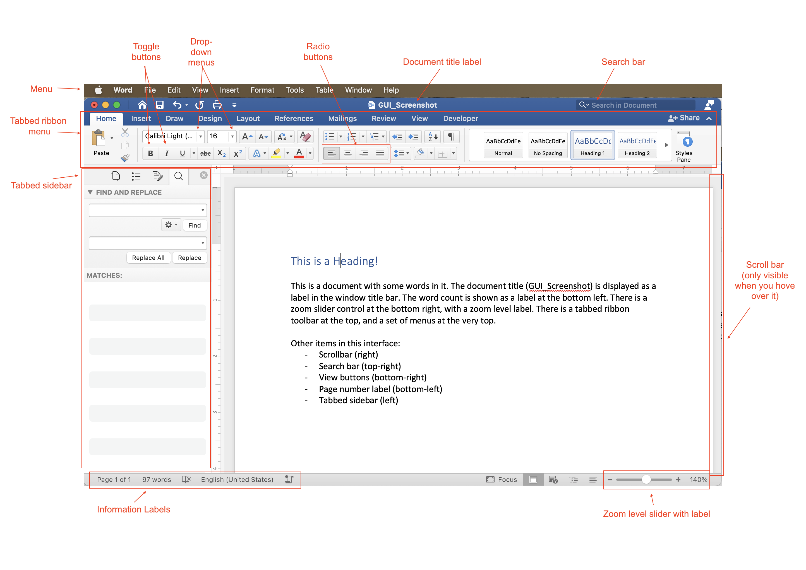

..  Copyright (C) Celine Latulipe.  Permission is granted to copy, distribute
    and/or modify this document under the terms of the GNU Free Documentation
    License, Version 1.3 or any later version published by the Free Software
    Foundation; with Invariant Sections being Forward, Prefaces, and
    Contributor List, no Front-Cover Texts, and no Back-Cover Texts.  A copy of
    the license is included in the section entitled "GNU Free Documentation
    License".

Building a Graphical User Interface (GUI)
=========================================

One of the important parts of event-based programming is building an interface for the user to interact with (after all, there is no point in creating event-handlers, if there is no way for a user to do anything). An event-based program can use a number of different modalities: it could be a graphical user interface (like most of the software on your computer or smartphone), or a voice-interface (like a Google Home or Amazon Alexa), or a gestural-interface (like the Microsoft Kinect), etc. We are going to focus on Graphical User Interfaces as they are still the most common interfaces. And so, you need to learn a bit about how graphical user interfaces are built.  

What's in a GUI?
----------------

Desktop/laptop software typically follows what is called the 'WIMP' paradigm: windows, icons, menus, and pointers. So, to create such software you need to draw a window on screen, structure commands into menus, create and display icons for control buttons, and you need to handle events related to the mouse pointer. On mobile phones there are no windows or pointers, a mobile app takes up the whole screen and works via touch, but there are also menus and icons, and other types of interactive controls. These are examples of GUIs. Think about common software that you have used, such as Microsoft Word or the camera app on your mobile phone. These interfaces are built up of quite a wide variety of visual components: menus, buttons, labels, scrollbars, sidebars, tabs, etc. Below is a labeled diagram that shows some of these elements:

A user interface programmer has to design the interface and write the code that will put all of these elements on screen. This static image just shows what the interface looks like at a given point in time, but of course, the interface changes as the user interacts with it. Buttons are toggled on or off, drop-down menu choices are changed, the scroll bar moves, labels get updated to reflect the current state of the program. And, if the user resizes the window, all the elements of the interface may need to dynamically shift around and/or resize. Here is the exact same interface, but reflecting some changes as the user edits their document, and makes the window smaller:

.. image:: Figures/word_GUI_v2.png
    :width: 600
    :align: center

Notice that now the scrollbars are visible, not all the tabbed menus are showing, the left sidebar has been hidden, and various labels have updated to reflect changes in the document. 

GUI Toolkits
------------

You have used turtles in this textbook to draw squares on a canvas. Imagine if, to create an interface like the ones above, you had to instruct a turtle to draw every square and every letter of every button, control, and label. That would be really tedious! Think about specifying the width and height and position of every button and the text and text size of every label in the interfaces above. Then think about writing code to redraw everything after the user interacts and changes things. This could get very complicated, very quickly.  Graphical user interfaces are very common and so, to make building them easier, many amazing programmers have developed GUI toolkits. These are modules that can be imported, and make it easier for you to design an interface.

GUI toolkits have multiple parts: they have ways to draw controls on screen, and they have ways to handle user events, such as clicks, drags, keyboard presses and touch events (for touchscreens). The turtle module is a partial GUI toolkit - it doesn't provide any way to put buttons or controls on screen, but it does allow for some very simple event handling on the canvas, such as the ability to register functions that can respond to mouse clicks and keyboard presses.

There are a variety of GUI toolkits available as modules for Python. One of the most famous is the TKinter toolkit (which is short for toolkit-interface). TKinter is a large, full-featured toolkit that has entire books written about it. It's complex and so we won't cover it in this introductory course. Instead, we will introduce you to a smaller and simpler toolkit called simpleGUI.

