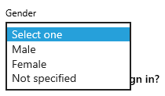

..  Copyright (C) Lauren Himbeault.  Permission is granted to copy, distribute
    and/or modify this document under the terms of the GNU Free Documentation
    License, Version 1.3 or any later version published by the Free Software
    Foundation; with Invariant Sections being Forward, Prefaces, and
    Contributor List, no Front-Cover Texts, and no Back-Cover Texts.  A copy of
    the license is included in the section entitled "GNU Free Documentation
    License".

Default Bias
=============

One of the important parts of writing code, especially when it comes to user-facing screens, is default settings. Often it is left up to a team of developers to decide what the default settings of an application or program should be and in this, developers wield a lot of power, often unknowningly. People have an inherent preference for inaction and leaving things as they are. Not many individuals have the know-how, or the will to make minute changes to their computer program or mobile phone. Issues begin to arise when these default options reinforce gender, racial or other negative stereotypes.

When Default Becomes Standard
-----------------------------
Let's take iPhone's and the default Siri voice. Siri has a woman-sounding voice by default and while there are options to change this, very few people do so. Words such as President and Secretary are already so strongly linked to men and women respectively, defaulting our friendly phone assistant to a woman-sounding voice reinforces this gender biases. There is a lot of power in choosing default settings that often goes unrecognized as a large decision.

Checkboxes, Radio Buttons, Dropdowns...oh my!
---------------------------------------------

In some scenarious, we can combat default setting with a blank choice or "Select one" option and allow the user to make choices. This is often seen when it comes to data entry for fields such as Religion, Title and Gender. But what happens when you don't fit into any of the choices?

Choosing to have an "Other" or "Not Specified" option is a solution that may work for some scenarios but for many it does not. When a user goes to select information that will identify them, if they don't see an option for them, we are telling the user, this software isn't for you. Even with an "unspecified" option, it can make a user feel left out, marginalized, and not considered when they interact with a product. Designers and developers are becoming more mindful of how these decisions affect people but we still see dropdowns for "Religion" or "Ethnicity" that do not allow a user to select more than one. Even with options like "interfaith" and "unspecified gender", we clump peoples with all different backgrounds and genders together. It becomes glaringly obvious that all considersations weren't discussed when implementing a screen.