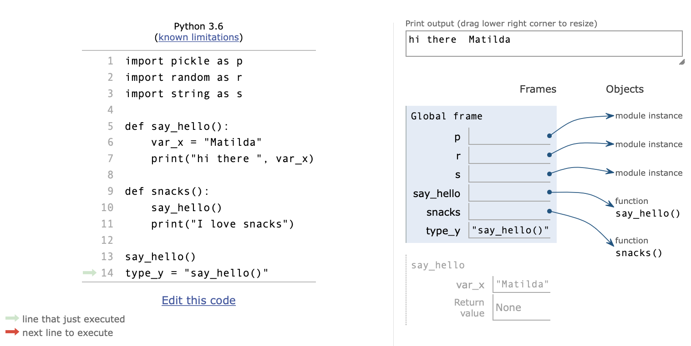

..  Copyright (C)  Brad Miller, David Ranum, Jeffrey Elkner, Peter Wentworth, Allen B. Downey, Chris
    Meyers, and Dario Mitchell.  Permission is granted to copy, distribute
    and/or modify this document under the terms of the GNU Free Documentation
    License, Version 1.3 or any later version published by the Free Software
    Foundation; with Invariant Sections being Forward, Prefaces, and
    Contributor List, no Front-Cover Texts, and no Back-Cover Texts.  A copy of
    the license is included in the section entitled "GNU Free Documentation
    License".

Chapter Assessment
==================

.. datafile:: travel_plans.txt
   :fromfile: travel_plans.txt
   :hide:

.. datafile:: school_prompt.txt
   :fromfile: school_prompt.txt
   :hide:

.. datafile:: emotion_words.txt
   :fromfile: emotion_words.txt
   :hide:

.. activecode:: assess_ch5_1
   :language: python
   :autograde: unittest
   :practice: T
   :available_files: travel_plans.txt
   :nocodelens:

   The textfile, ``travel_plans.txt``, contains the summer travel plans for someone with some commentary. Find the total number of characters in the file and save to the variable ``num``.
   ~~~~

   =====

   from unittest.gui import TestCaseGui

   class myTests(TestCaseGui):

      def testOne(self):
         self.assertEqual(num, 316, "Testing that num value is assigned to correct value.")

   myTests().main()

.. activecode:: assess_ch5_2
   :language: python
   :autograde: unittest
   :practice: T
   :available_files: emotion_words.txt
   :nocodelens:

   We have provided a file called ``emotion_words.txt`` that contains lines of words that describe emotions. Find the total number of words in the file and assign this value to the variable ``num_words``.
   ~~~~

   =====

   from unittest.gui import TestCaseGui

   class myTests(TestCaseGui):

      def testOne(self):
         self.assertEqual(num_words, 48, "Testing that num_words was assigned to the correct value.")

   myTests().main()

.. activecode:: assess_ch5_3
   :language: python
   :autograde: unittest
   :practice: T
   :available_files: school_prompt.txt
   :nocodelens:

   Assign to the variable ``num_lines`` the number of lines in the file ``school_prompt.txt``.
   ~~~~

   =====

   from unittest.gui import TestCaseGui

   class myTests(TestCaseGui):

      def testOne(self):
         self.assertEqual(num_lines, 10, "Testing that num_lines has the correct value.")

   myTests().main()

.. activecode:: assess_ch5_4
   :language: python
   :autograde: unittest
   :practice: T
   :available_files: school_prompt.txt
   :nocodelens:

   Assign the first 30 characters of ``school_prompt.txt`` as a string to the variable ``beginning_chars``.
   ~~~~

   =====

   from unittest.gui import TestCaseGui

   class myTests(TestCaseGui):

      def testOne(self):
         self.assertEqual(len(beginning_chars), 30, "Testing that beginning_chars has the correct length.")
         self.assertEqual(beginning_chars, "Writing essays for school can ", "Testing that beginning_chars has the correct string.")

   myTests().main()

.. activecode:: assess_ch5_5
   :language: python
   :autograde: unittest
   :practice: T
   :available_files: school_prompt.txt
   :nocodelens:

   **Challenge:** Using the file ``school_prompt.txt``, assign the third word of every line to a list called ``three``.
   ~~~~

   =====

   from unittest.gui import TestCaseGui

   class myTests(TestCaseGui):

      def testOne(self):
         self.assertEqual(three, ['for', 'find', 'to', 'many', 'they', 'solid', 'for', 'have', 'some', 'ups,'], "Testing that three has the correct value.")

   myTests().main()

.. activecode:: assess_ch5_6
   :language: python
   :autograde: unittest
   :practice: T
   :available_files: emotion_words.txt
   :nocodelens:

   **Challenge:** Create a list called ``emotions`` that contains the first word of every line in ``emotion_words.txt``.
   ~~~~

   =====

   from unittest.gui import TestCaseGui

   class myTests(TestCaseGui):

      def testOne(self):
         self.assertEqual(emotions, ['Sad', 'Angry', 'Happy', 'Confused', 'Excited', 'Scared', 'Nervous'], "Testing that emotions was created correctly.")

   myTests().main()

.. activecode:: assess_ch5_7
   :language: python
   :autograde: unittest
   :practice: T
   :available_files: travel_plans.txt
   :nocodelens:

   Assign the first 33 characters from the textfile, ``travel_plans.txt`` to the variable ``first_chars``.
   ~~~~

   =====

   from unittest.gui import TestCaseGui

   class myTests(TestCaseGui):

      def testFive(self):
         self.assertEqual(first_chars, "This summer I will be travelling.", "Testing that first_chars is assigned to correct value.")

   myTests().main()

.. activecode:: assess_ch5_8
   :language: python
   :autograde: unittest
   :practice: T
   :available_files: school_prompt.txt
   :nocodelens:

   **Challenge:** Using the file ``school_prompt.txt``, if the character 'p' is in a word, then add the word to a list called ``p_words``.
   ~~~~

   =====

   from unittest.gui import TestCaseGui

   class myTests(TestCaseGui):

      def testOne(self):
         self.assertEqual(p_words, ['topic', 'point', 'papers,', 'ups,', 'scripts.'], "Testing that p_words has the correct list.")

   myTests().main()

.. activecode:: assess_ch5_9
   :language: python
   :autograde: unittest
   :practice: T
   :available_files: SP500.txt
   :topics: Files/ReadingCSVFiles

   Read in the contents of the file ``SP500.txt`` which has monthly data for 2016 and 2017 about the S&P 500 closing prices as well as some other financial indicators, including the "Long Term Interest Rate", which is interest rate paid on 10-year U.S. government bonds.

   Write a program that computes the average closing price (the second column, labeled SP500) and the highest long-term interest rate. Both should be computed only for the period from June 2016 through May 2017. Save the results in the variables ``mean_SP`` and ``max_interest``.

   ~~~~

   =====

   from unittest.gui import TestCaseGui

   class myTests(TestCaseGui):

      def testOne(self):
         self.assertLess(abs(mean_SP - 2237), 0.5, "Testing that mean_SP is within 0.5 of the correct value. Make sure to use only the correct 12 month period.")
         self.assertEqual(max_interest, 2.49, "Testing the max_interest is correct. Make sure to use only the correct 12 month period.")

   myTests().main()

.. datafile:: SP500.txt

    Date,SP500,Dividend,Earnings,Consumer Price Index,Long Interest Rate,Real Price,Real Dividend,Real Earnings,PE10
    1/1/2016,1918.6,43.55,86.5,236.92,2.09,2023.23,45.93,91.22,24.21
    2/1/2016,1904.42,43.72,86.47,237.11,1.78,2006.62,46.06,91.11,24
    3/1/2016,2021.95,43.88,86.44,238.13,1.89,2121.32,46.04,90.69,25.37
    4/1/2016,2075.54,44.07,86.6,239.26,1.81,2167.27,46.02,90.43,25.92
    5/1/2016,2065.55,44.27,86.76,240.23,1.81,2148.15,46.04,90.23,25.69
    6/1/2016,2083.89,44.46,86.92,241.02,1.64,2160.13,46.09,90.1,25.84
    7/1/2016,2148.9,44.65,87.64,240.63,1.5,2231.13,46.36,91,26.69
    8/1/2016,2170.95,44.84,88.37,240.85,1.56,2251.95,46.51,91.66,26.95
    9/1/2016,2157.69,45.03,89.09,241.43,1.63,2232.83,46.6,92.19,26.73
    10/1/2016,2143.02,45.25,90.91,241.73,1.76,2214.89,46.77,93.96,26.53
    11/1/2016,2164.99,45.48,92.73,241.35,2.14,2241.08,47.07,95.99,26.85
    12/1/2016,2246.63,45.7,94.55,241.43,2.49,2324.83,47.29,97.84,27.87
    1/1/2017,2275.12,45.93,96.46,242.84,2.43,2340.67,47.25,99.24,28.06
    2/1/2017,2329.91,46.15,98.38,243.6,2.42,2389.52,47.33,100.89,28.66
    3/1/2017,2366.82,46.38,100.29,243.8,2.48,2425.4,47.53,102.77,29.09
    4/1/2017,2359.31,46.66,101.53,244.52,2.3,2410.56,47.67,103.74,28.9
    5/1/2017,2395.35,46.94,102.78,244.73,2.3,2445.29,47.92,104.92,29.31
    6/1/2017,2433.99,47.22,104.02,244.96,2.19,2482.48,48.16,106.09,29.75
    7/1/2017,2454.1,47.54,105.04,244.79,2.32,2504.72,48.52,107.21,30
    8/1/2017,2456.22,47.85,106.06,245.52,2.21,2499.4,48.69,107.92,29.91
    9/1/2017,2492.84,48.17,107.08,246.82,2.2,2523.31,48.76,108.39,30.17
    10/1/2017,2557,48.42,108.01,246.66,2.36,2589.89,49.05,109.4,30.92
    11/1/2017,2593.61,48.68,108.95,246.67,2.35,2626.9,49.3,110.35,31.3
    12/1/2017,2664.34,48.93,109.88,246.52,2.4,2700.13,49.59,111.36,32.09

.. fillintheblank:: assess_ch5_10_lh
    :casei:

    .. image:: Figures/cdq5-1.png
        :width: 900
        :align: center
        :alt: image of numerous variables being declared and assigned values

    The hello function is in the |blank| scope, while var_x is in the |blank| scope.

    -   :global:      Correct! This function is in the global scope and avalaible for use everywhere.
        :.*:          Hmmm try again, look at the image to see the different frames
    -   :local:    Correct! Variables used in a local scope context are only available in that context
        :.*:           Hmmm try again, look at the image to see the different frames?

.. mchoice:: assess_ch5_11_lh
   :multiple_answers:
   :answer_a: an error
   :answer_b: 5
   :answer_c: Hello there, I am a method.
   :answer_d: x
   :answer_e: 10
   :correct: a
   :feedback_a: This is a correct. The code reads top to bottom and we hit an error of hello() not being defined before any prints happen.
   :feedback_b: Hmm, this is inside the hello() function. Does our code get that far?
   :feedback_c: Hmm, this is inside the hello() function. Does our code get that far?
   :feedback_d: x is a variable, not the value. You can tell because it doesn't have quotes
   :feedback_e: Hmm, this is at the bottom of our code. Does our code get that far?

   .. image:: Figures/cdq5-2.png

   What does the following code print? Be sure to examine the current state of the program what will happen on the next executable line. Select as many as apply.

.. clickablearea:: assess_ch5_12_lh
    :question: Given the image below, select the lines of code that call a function.
    :feedback: Remember, the () indicate a function (even if there is something between them)    
    :iscode:

    :click-incorrect:import pickle as p:endclick:
    :click-incorrect:import random as r:endclick:
    :click-incorrect:import string as s:endclick:

    :click-incorrect:def say_hello()::endclick:
          :click-incorrect:var_x = "Matilda"::endclick:
          :click-correct:print("hi there ", var_x):endclick:

    :click-incorrect:def snacks()::endclick:
      :click-correct:say_hello():endclick:
      :click-correct:print("I love snacks"):endclick:

    :click-correct:say_hello():endclick:
    :click-incorrect:type_y =:endclick: :click-incorrect:"say_hello()":endclick:
    :click-incorrect:type_h =:endclick: :click-correct:type(say_hello()):endclick:

