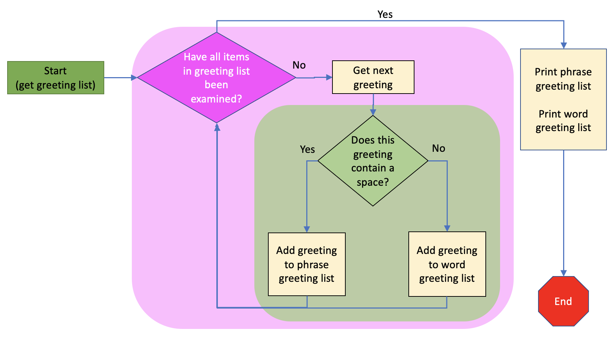

..  Copyright (C) Celine Latulipe.  Permission is granted to copy, distribute
    and/or modify this document under the terms of the GNU Free Documentation
    License, Version 1.3 or any later version published by the Free Software
    Foundation; with Invariant Sections being Forward, Prefaces, and
    Contributor List, no Front-Cover Texts, and no Back-Cover Texts.  A copy of
    the license is included in the section entitled "GNU Free Documentation
    License".

.. qnum::
   :prefix: func-1-
   :start: 1

Combining Iterations and Conditionals
=====================================

In this section, we will look at examples where:
* We iterate inside of a conditional branch (inside an if, elif, or else block)
* We use conditional execution inside an iteration block (loop)

Remember that we use conditionals structures when we need the computer to make a decision, and we use iteration when we need the computer to repeat things. So we combine these things when we need to repeatedly make decisions about something, or when the result of a decision means we need to do something repeatedly. We'll look at each of these in turn.

Iteration inside Conditional Blocks
-----------------------------------

We have iteration inside of a conditional block when the result of a decision means we need to execute some code repeatedly. The iteration might occur in the if block, the else block or an elif block, or may occur in multiple places. Here's what that could look like: 

.. image:: Figures/iteration_inside_conditional.png
    :width: 600
    :align: center

The image above shows a few different versions of what it might look like to have a loop inside a branch of an if statement. There can be a loop in just one branch, in both or either branches of an if-else, and in any of the branches of an if-elif-else statement.

Let's look at a simple example that encodes a user's text input.

.. activecode:: ac7_3_1

   user_text = input("Please enter a word with no spaces:")

   if user_text != "None":
      encoded_text = ""
      for c in user_text:
          # convert character to ordinal, add 1, convert back to character
          encoded_text += chr(ord(c)+1)

      print("Encoded word is: ", encoded_text)

   else:
      print("User did not enter a word.")

In the above example, we get user input. That should give us a string of letters. But, what if the user clicks cancel? In that case the input statement will return the special value "None". We need to find out if the user gave us input or not. So we use an if statement to check. If the user_text isn't "None", then we want to go through each letter in the text and increment the character, so we use a loop in the if part of the if-else statement.

Conditional Execution inside Iteration Blocks
---------------------------------------------

Conditional execution may happen inside of a for loop, and this is really common. It looks like this:

.. image:: Figures/conditionals_inside_iteration.png
    :width: 600
    :align: center

When we are iterating across a list of items, we often need to inspect each item and then make a decision about what to do with that item. Imagine we have a list of phrases and we want to separate single-word from multi-word phrases (items that contain a space). This flow chart shows what we want to achieve:

The code below accomplishes this by using an if statement inside a for loop. We are also using the append method on lists, which we cover soon in the Sequences chapter.

.. activecode:: ac7_3_2

   greetings = ["hello", "good bye", "have a nice day", "ciao", "see ya", "bye", "bonjour", "au revoir", "adios"]
   phrase_greetings = []
   word_greetings = []

   for greeting in greetings:
       if ' ' in greeting:
           #add greeting to phrase greetings
           phrase_greetings.append(greeting)
       else:
           #add to single-word greetings
           word_greetings.append(greeting)

   print("Phrase greetings include:", phrase_greetings) 
   print("Word greetings include:", word_greetings)  
  
Things to note abbout this code: 

* we are iterating through a list, and our iterator is called 'greeting', a singular of the list name 'greetings'
* for each greeting, we have a conditional statement that looks to see if there is a space in the item text, using the 'in' operator
* this code would not work if the greetings list had non-text items in it (remember - it's a bad idea to put different types in a list)

