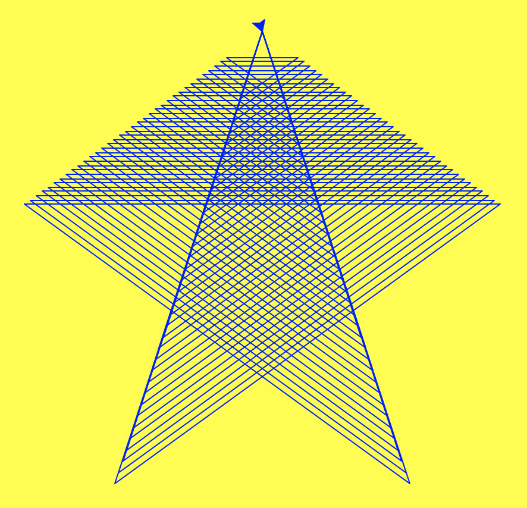
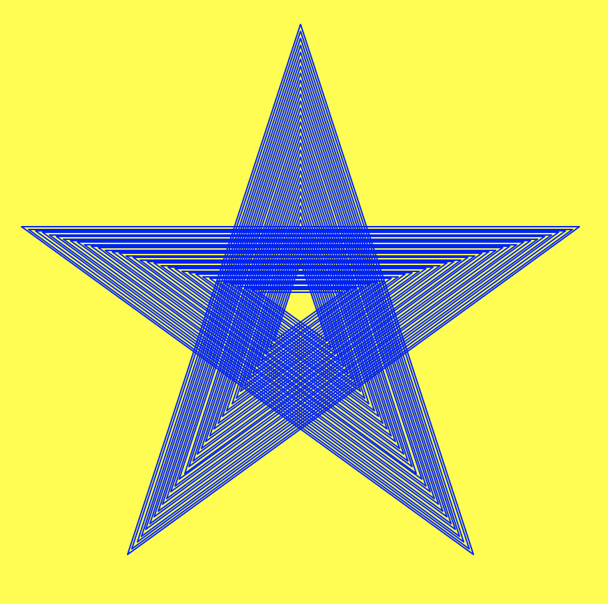

..  Copyright (C)  Celine Latulipe.  Permission is granted to copy, distribute
    and/or modify this document under the terms of the GNU Free Documentation
    License, Version 1.3 or any later version published by the Free Software
    Foundation; with Invariant Sections being Forward, Prefaces, and
    Contributor List, no Front-Cover Texts, and no Back-Cover Texts.  A copy of
    the license is included in the section entitled "GNU Free Documentation
    License".

Week 10 Lab
===========

.. admonition:: Material Covered

   Indefinite Iteration (Chapter 10)

Level 1
-------

In this level you will write code to add student names to a list of students registered in a lab, until the user is done entering names.  You start with a list that already has some student names in it. The screenshot below shows what the final interaction with the user should look like.

This code needs to follow the general pattern in which a boolean flag is initialized to true outside a loop, and then the loop executes an unknown number of times, but at some point, due to something that happens, the boolean flag gets set to false and the loop stops executing. The thing that happens might be based on random generation, or based on user input, or based on calculations of data that have been read in. There are lots of things that can be the reason that triggers a line of code where the boolean flag flips from true to false. What is critical is that there is *something* that will make this happen, otherwise you create an infinite loop.

#. In the given code, there is one line that is commented out. You can run the given code and you will see that it prints out the list of students registered in the lab. You need to define the register_lab_students function. That function should accept a list as a parameter and return a list. 

#. Inside the function, you need to create a flag to indicate that there are still more students to register. Name the flag something appropriate and initialize it to True.

#. Now create a while loop that will continue to execute while the boolean flag variable is true.

#. Inside the while loop, ask the user to enter a student name, or type q to quit. 

#. If the user typed 'q' or 'Q', you should set the boolean flag to false. Otherwise you should add the name to the list, and print out a message noting that the student has been added (see screenshot above).

#. At the end of the function return the list. 

#. Test your code to make sure it is working properly. 

.. activecode:: lab10_level1
       
    ################################################################
    # Student name, ID & lab section
    # Date
    # Lab 10, Level 1
    ################################################################
    
    def register_lab_students(list):
        more_to_register = True
        while more_to_register:
            name = input("Please enter name of student to register: (or 'q' to quit) ")
            if (name == 'Q' or name == 'q'):
                more_to_register = False
            else: 
                list.append(name) 
                print(name, "is now registered in the lab.")

    def main():
        student_list = ["Surya Arevik", "Marjan Amen", "Mohamad Mordechai", "Modesta Niketas", "Abraão Ivor" ]
        student_list = register_lab_students(student_list)
        print("Students registered for the lab section are:")
        for i in range(len(student_list)):
            print(i, ": ", student_list[i])

    main()

Level 2
-------

In this level you will make a turtle draw a 5-pointed star pattern.

1. In the main() function, create two local variables, one called *size* and one called *top*. Set top equal to 200 (the top of the window) and size equal to 400 (this will be the initial side length of the star).
  
2. Still in main(), move the turtle to the top center of the window without drawing a line, then rotate it to the right 72 degrees and put the pen back down, so the turtle is ready to draw.

3. Define a function called star that takes in two parameters: a turtle and a side length for the star. In this function you should have a for loop that will move the turtle around to draw a five sided star (DO NOT use the goto() method). To get the correct shape, rotate the turtle 216 degrees to the left at each point of the star (note that there is a global constant defined for this!). Make sure you use the passed in length for the size of each star side. 
   
4. Call the star function from main, passing in the turtle and the size.  Make sure you're getting the correct output (see below).

.. image:: Figures/Lab10_single_star.jpg

5. In main(), create a variable called *smallest* and set it to 50. This is the smallest size of star that you want to draw. 
  
6. Create a while loop that will run while *size* is bigger than *smallest*. Inside the loop, call the star function. Then decrement *size* by 10. Run this code, and you should see the output below.

6. To keep the star in the center, you also need to decrement *top* by 5 and move the turtle to (0,top) again during each loop iteration. Be sure to lift the pen up and down to prevent added lines!

Here is what your final output should look like:

Note that the benefit of using a while loop here is we don't have to guess how many times to run the loop, the while loop's *repeat until some thing is false* logic takes care of that for us. You can play around with different values of *smallest* to control when the turtle stops drawing, which will generate different star effects. 

.. activecode:: lab10_level2
    
    ################################################################
    # Student name, ID & lab section
    # Date
    # Lab 10, Level 2
    ################################################################
    import turtle
    STAR_ANGLE = 216

    # Add your draw star function here

    def main():
        wn = turtle.Screen()
        wn.bgcolor("black")
        ari = turtle.Turtle()
        ari.color("blue")
        air.speed(50) # we need the turtle to go really fast 
        
    main()  

Level 3
-------

In this level you will make a program that takes in user input to move a turtle around the screen until the user wishes to stop.

1. In the main function, create a boolean variable and set it to True, this will be the variable used in our while loop check and we want to keep on drawing while the variable is still True, so give the variable a name that reflects that.

2. Create a while loop using the boolean variable created in step 1. 

3. Inside the while loop, start by getting the user input, "Enter an x and y coordinate separated by a space (q to quit): ". 

4. Check if the user entered q. If they did, change the boolean variable appropriately, otherwise split the user input string and create two new variables x and y, setting them to the split string values. 
   
5. Now move the turtle to the appropriate location

.. activecode:: ac_lab10_level3
   

   ################################################################
   # Student name, ID & lab section
   # Date
   # Lab 10, Level 3
   ################################################################
   import turtle

   def main():
        wn = turtle.Screen()
        wn.bgcolor("black")
        jie = turtle.Turtle()
        jie.color("red")

        keep_drawing = True

   main()

  

