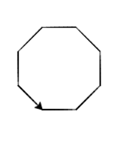

..  Copyright (C)  Celine Latulipe.  Permission is granted to copy, distribute
    and/or modify this document under the terms of the GNU Free Documentation
    License, Version 1.3 or any later version published by the Free Software
    Foundation; with Invariant Sections being Forward, Prefaces, and
    Contributor List, no Front-Cover Texts, and no Back-Cover Texts.  A copy of
    the license is included in the section entitled "GNU Free Documentation
    License".

Week 2 Lab
==========

.. admonition:: Material Covered

    Basic interactivity, turtles, operands, basic functions (Chapters 1 & 2)

Level 1
-------

Your objective in this level is to complete the code below so that a turtle draws an octagon on the canvas, like this:

.. tip::
   
    You are given some code to start with, do not edit these lines!

.. activecode:: lab2_level1
    :nocodelens:

    ################################################################
    # Student name, ID & lab section
    # Date
    # Lab 2, Part 1
    ################################################################
   
    import math              #imports the math library
    import turtle              #imports the turtle library
    
    wn = turtle.Screen()   #creates a graphics window

#. Create a turtle variable
#. Create a variable for the side length of an octagon, and ask the user to input a length (don't forget the conversion)
#. Calculate a turn angle and store this in a variable. An octagon has eight sides, meaning you will have to turn your turtle eight times. Do some basic division to figure out by how many degrees your turtle will have to turn after each side.
#. Make the turtle draw the octagon using the side length variable and the angle variable.  Note: This part will be very repetitive, but we will learn a way to avoid retyping the same commands in a few weeks

Level 2
-------

Building upon your program from level 1, your objective is to calculate the area of the octagon the turtle drew and print out the area to the console.

.. tip::
   
    Octagon area = the length of a side squared, multiplied by 2, multiplied by (one plus square root of two)

   
.. tip::
   
    The function to get a square root is: math.sqrt()

.. activecode:: lab2_level2
    :nocodelens:
    ################################################################
    # Student name, ID & lab section
    # Date
    # Lab 2, Part 2
    ################################################################
   

#. Copy your code from Level 1 into the active code window above.
#. Create a variable and assign to it the area of the octagon, using the formula in the tip above for the calculation
#. Print out the value to the console, using the following format:

.. image:: Figures/output_format.png
   :width: 600
   :align: center

4. Make sure your formula is correct by cross referencing your answer with the answer you get using a calculator

Level 3
-------

Below is a program similar to the type created in level 1 and 2: first a turtle draws a square, then the area of the square is printed out in the console. 
Objective: Convert this code into a generalized program that uses user input to set the length of the sides of the square. Use this input value to draw the square and to calculate and report the area of the square.

.. activecode:: lab2_level3   
    :nocodelens:

    ################################################################
    # Student name, ID & lab section
    # Date
    # Lab 2, Part 3
    ################################################################

    import turtle             
    wn = turtle.Screen()      
    
    level = turtle.Turtle()  
    
    level.forward(50)        
    level.left(90)             
    level.forward(50)        
    level.left(90) 
    level.forward(50)        
    level.left(90) 
    level.forward(50)        
    
    area = 50 ** 2
    
    print("The area of a square with a side length of 50 is ", area)

.. tip::

    You only need to add one line of code, the rest is just editing the code that is there.

