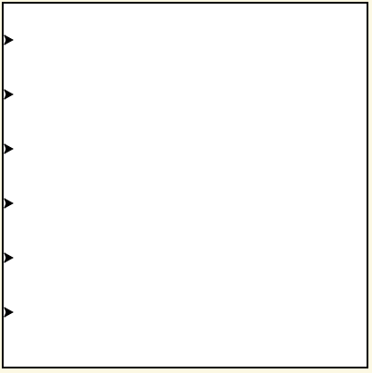
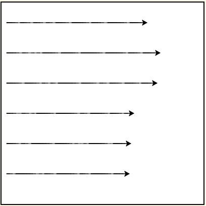

..  Copyright (C)  Celine Latulipe.  Permission is granted to copy, distribute
    and/or modify this document under the terms of the GNU Free Documentation
    License, Version 1.3 or any later version published by the Free Software
    Foundation; with Invariant Sections being Forward, Prefaces, and
    Contributor List, no Front-Cover Texts, and no Back-Cover Texts.  A copy of
    the license is included in the section entitled "GNU Free Documentation
    License".

Week 4 Lab
==========

.. admonition:: Material Covered

   Basic iteration, for loops (Chapter 4)

Level 1
-------

The program below is the solution to the Week 2 Lab Level 1 (the turtle drawing an octagon). Edit this program to use a for loop to draw the octagon. Your output should look the exact same as before (see image below code).

.. tip::
   
   You only need to add one line of code (the for loop header) otherwise you should be deleting code.

.. activecode:: lab4_level1
    :nocodelens:
   
    ################################################################
    # Student name, ID & lab section
    # Date
    # Lab 4, Level 1
    ################################################################

    import turtle             # imports the turtle library
    wn = turtle.Screen()      # creates a graphics window
 
    side = int(input("Enter an integer for the side length:")) 
    winner = turtle.Turtle()  # creates a turtle variable named winner

    # The following chunk moves winner 'side' length forward then rotates
    # it 45 degrees. Note the code repetition, this can be avoided once
    # we learn about iteration in unit 4
    winner.forward(side)        
    winner.left(45)             
    winner.forward(side)        
    winner.left(45) 
    winner.forward(side)        
    winner.left(45) 
    winner.forward(side)        
    winner.left(45) 
    winner.forward(side)        
    winner.left(45) 
    winner.forward(side)        
    winner.left(45)
    winner.forward(side)        
    winner.left(45)
    winner.forward(side)  

.. image:: Figures/octagon.png
   :width: 600
   :align: center

#. Figure out how many times you need to loop.
#. Add a for loop that uses the range() function to loop the appropriate number of times.
#. Put the code to make the turtle move and turn (just once) inside the for loop (make sure the indentation is correct).
#. Test to make sure the turtle is drawing the octagon properly.

Level 2
-------

In this level you will create and position six turtles vertically along the left side of the screen so that they can have a race (in Level 3 you will make the turtles race). The turtles need to be lined up as shown below:

#. You are given some code below to start with.
#. Create five more turtles, each with a distinct name.
#. Create a list with the six turtles in it (see tip below).

.. tip:: 
   If your turtles are named t1, t2, etc. create the list like this: ``turtle_list = [t1, t2, t3, t4, t5, t6]``

4. Create a for loop header that will iterate through the list of turtles. The for loop header will need an iterator variable that will get assigned to each turtle as the loop iterates through the list. **Give this iterator variable an appropriate name.**
5. Here comes the big step. We want to move the turtles into their start positions. The turtles all start at the left, but each turtle's vertical position is slightly different. So, we need to loop through the turtles, moving them one at a time, changing the vertical position each time through the loop. Follow the steps below to do this.

   a. Start by creating two variables (an X_POSITION that is a constant - use all caps and a y_position) below the comment saying "Add your code below". We will use these variables to move the turtles into position. We want the turtle to start on the left side of the window. The center of the canvas is (0, 0) and the left edge of the canvas is -200, so set the x position to something like -190. The y variable will need to start near the top of the window for the first turtle, so set it to something like 160 (the top edge of the canvas is 200).
   b. Add a third variable to store the vertical distance you are going to add to space out the turtles. Set this to something like 50 or 60.
   c. Now add a goto() command in your for loop using these x and y position variables. Remember that your iterator variable will refer to one of your turtles each time through the loop, so you are calling the goto() command on that iterator variable you created with the for loop.
   d. Decrement your y_position variable appropriately (by subtracting the vertical distance variable you created in sub-step 2). By decrementing the y position variable during each iteration of the loop, you will be able to space out the turtles down the left side of the window.

6. If you run this you should now see your turtles move to the left side of the screen, but they are drawing lines as they move. We don't want that! Add a penup() and pendown() command before and after the goto() so that the turtles don't draw while moving into their start positions.

.. activecode:: lab4_level2
    :nocodelens:

    ################################################################
    # Student name, ID & lab section
    # Date
    # Lab 4, Level 2
    ################################################################

    import turtle #imports the turtle library
    import random #imports the random library

    wn = turtle.Screen() #creates a graphic window

    #-----Add your code below-----------

    t1 = turtle.Turtle()

Level 3
-------

This level builds upon your code in level 2. We want to have the turtles race, by moving all of the turtles to the right ten times, but a random distance each time. The end of your program's output should look similar to this (bearing in mind each turtle will move a random distance each time):

#. Copy the code from Level 2 into the window below
#. Create a second for loop **below** the first. This loop should iterate 10 times (use the range function). This loop should **not** be nested inside the for loop from Level 2. To test that this is working add a print statement inside this loop and make sure that whatever you print out prints out 10 times on the console. You should still see the turtles at their left side starting points - they won't be doing anything yet.
#. Inside this second loop, create a nested for loop that will iterate through the list of turtles. Add a different print statement inside this loop. 
#. In the inner for loop you just created add a command that moves the current turtle forward a random amount of pixels between 0 and 60.

.. note:: 
   A turtle may go off the right end of the window when you run this code, that is okay. We can prevent this later on once we learn about conditionals.

5. For a fun bonus, at the top of the code where you create each turtle, set each turtle to a different color using the .color("Red") or .color("Blue"), etc. commands.

.. activecode:: lab4_level3   
   :nocodelens:

    ################################################################
    # Student name, ID & lab section
    # Date
    # Lab 4, Level 3
    ################################################################

    

