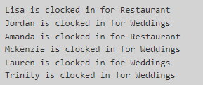
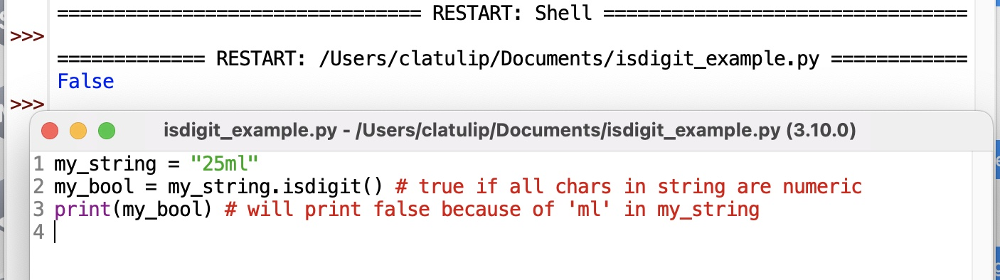
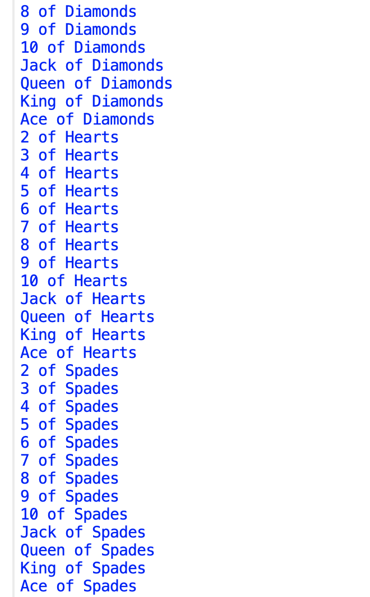

..  Copyright (C)  Celine Latulipe.  Permission is granted to copy, distribute
    and/or modify this document under the terms of the GNU Free Documentation
    License, Version 1.3 or any later version published by the Free Software
    Foundation; with Invariant Sections being Forward, Prefaces, and
    Contributor List, no Front-Cover Texts, and no Back-Cover Texts.  A copy of
    the license is included in the section entitled "GNU Free Documentation
    License".

Week 7 Lab
==========

.. admonition:: Material Covered

   Combining functions, iteration and conditionals (Chapter 7)

Level 1
-------

In this level you are given scrambled lines of code, the objective is to use these lines to recreate the following output. This code combines a function, iteration and conditional statements together.

Output should look like this:

.. tip:: 

   Don't forget to use the proper indentation.
   Every line must be used only once.
   You do not need to add, delete or alter any code in this level, but you will have to indent some lines.

.. activecode:: la7_level1
       
    ################################################################
    # Student name, ID & lab section
    # Date
    # Lab 7, Level 1
    ################################################################

    names = ['R Lisa', 'W Jordan', 'R Amanda', 'W Mckenzie', 'W Lauren', 'W Trinity']

    print(name[2:], 'is clocked in for Restaurant')

    time_clock()

    if name[0] == 'R':

    for name in names:

    def time_clock():

    elif name[0] == 'W':

    print(name[2:], 'is clocked in for Weddings')    

Level 2
-------

In this level you will use conditional statements to validate user input. In the program below, we ask the end user
to enter a number and then we square that number and print out the result. But, a problem occurs if the user enters
something like "seven" instead of "7". Similarly, if they enter "$45" instead of "45", Python can't convert that into an int (because of the dollar sign) and so a runtime error will occur.

Follow the steps below to add input validation.

#. First run the given code and enter a valid number to see what happens.
#. Next, run the given code but type in something like "seven" or "hello" or "$45" and see what happens.  You will see a runtime error (specifically a ValueError), because Python can't convert the user's string into an integer.
#. Add a boolean variable called input_valid at the top of the script and set this to True. This is what we call a 
   *flag* variable. It will stay true unless it turns out that the user gives bad input, in which case you will
   set it to false.
#. Write an if statement that checks the value of the flag variable. If it is true, the three lines that convert the input, square it and print it out (lines 13-15) should be executed (you'll need to indent them in the if block). If the flag variable is false, you should print out a message that reports the input received and tells the user it is not a valid input. (Something like "You entered 'eighteen' which is not a valid number").
#. Test this. As long as you give good input, the program should still work. But if you give bad input, the program still tries to use the input and convert it to an int, so it crashes. That's because you haven't yet done anything to detect bad input and set the flag to False.
#. Now, you need to test the input and if it's bad, you need to set the flag to False. This detection code has to be added *above* the if statement you worked on in the last step (you want to check to ensure the input is valid before attempting to convert it to an int). You will need to use a built-in string method called *isdigit()* (see below for a usage example). You can call this method on a string and it will return true only if all of the characters in the string are numeric digits. You need to write an if statement that tests whether num_str.isdigit() returns true or false. But, you want to do something only if it is false. So you need to use the *not* operator in your test. Pseudocode for your if statement: *if not all digits, then set input_valid flag to false*.

7. Inside the if block, set the input_valid boolean flag to False. There is no else block needed.
8. Now test your code. If you type in something like *$45* your if statement should detect that not all the characters are digits and it should set input_valid to false. The second if statement should now print out an error message because the input_valid flag is not true. 
   
.. activecode:: lab7_level2
    
    ################################################################
    # Student name, ID & lab section
    # Date
    # Lab 7, Level 2
    ################################################################

    # check user input for digits

    num_str = input("Please enter a number between 0 and 1000")

    num = int(num_str)
    square = num*num
    print("You entered:", num_str, "which is", square, "squared")

Level 3
-------
In this level you will create a nice deck of cards. Here is a snippet of the output you are aiming for:

The code below gets you most of the way there. That code prints out the cards for each suit. However, for the face cards, it is just printing out numbers. We want the face cards written out as 'Queen of Diamonds' and 'Ace of Spades', not '12 of Diamonds' and '14 of Spades', etc. 

To do this, you will need to add a chained conditional that tests for the numbers 11-14. If the current number isn't any of those, then card = str(num) should be executed as the default. Look at the comments in the code to help figure out what the chained conditional should look like.

.. activecode:: lab7_level3   

    ################################################################
    # Student name, ID & lab section
    # Date
    # Lab 7, Level 3
    ################################################################

    DECK_SIZE = 52
    NUM_SUITS = 4
    suits = ["Clubs", "Diamonds", "Hearts", "Spades"]
    deck = []

    for suit in suits: # go through each suit
        for num in range(2, DECK_SIZE//NUM_SUITS + 2): # get cards from 2-14

            # TODO: check if num represents a face card
            # if it does set card to that instead of num
            # 11 -> Jack
            # 12 -> Queen
            # 13 -> King
            # 14 -> Ace
            # if none of above, card is just the number

            card = str(num)        
            card_string = card + " of " + suit
            deck.append(card_string) # this adds the card to the deck list

    for card in deck:
        print(card)

