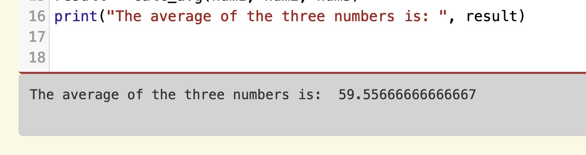

..  Copyright (C)  Celine Latulipe.  Permission is granted to copy, distribute
    and/or modify this document under the terms of the GNU Free Documentation
    License, Version 1.3 or any later version published by the Free Software
    Foundation; with Invariant Sections being Forward, Prefaces, and
    Contributor List, no Front-Cover Texts, and no Back-Cover Texts.  A copy of
    the license is included in the section entitled "GNU Free Documentation
    License".

Week 8 Lab
==========

.. admonition:: Material Covered

   Functions with Parameters and Return Values (Chapter 8)

Level 1
-------

In this level you will create a function that will take in 3 floats and return the average value of the floats.

#. The starter code below creates three user input variables (floats), asking the user to enter a decimal number (note that we don't use the word *float* in the prompt - end users don't know what floats are!). Create a function header for a function that takes in three parameters and will calculate their average. Name the function something that makes sense and reflects what it will do.

#. Inside the function, create a variable and assign to it the average value of the three passed in floats. Note: To calculate an average you take the sum of inputs and divide it by the number of inputs.

#. After the line that calculates and stores the average in a variable, return that variable.

#. At the bottom of the script, call your newly defined function, passing in the three numbers. Assign the result of calling the function to a new variable. 

#. Finally, create a print statement that includes the following: "The average is," then the average. 
   
Below is an example of the output, after a user enters 56.89, 23.45, and 98.33

.. activecode:: lab8_level1
       
    ################################################################
    # Student name, ID & lab section
    # Date
    # Lab 8, Level 1
    ################################################################
    
    num1 = float(input("Please enter a decimal number: "))
    num2 = float(input("Please enter another decimal number: "))
    num3 = float(input("Please enter a third decimal number: "))

Level 2
-------

In this level you will create a turtle program that will draw a whole bunch of squares that vary in size and colour. You are given starter code with a list of colours in it, and a turtle and a window. Follow the steps. 

.. activecode:: lab8_level2
    
    ################################################################
    # Student name, ID & lab section
    # Date
    # Lab 8, Level 2
    ################################################################
    import turtle
    import random

    #TODO: define your square function that takes parameters here
            

    def move_random(turt):
        x = random.randrange(-180, 180)
        y = random.randrange(-180, 180)
        turt.penup()
        turt.goto(x,y)
        turt.pendown()

    def main():
        MIN_SQUARE = 40
        MAX_SQUARE = 90
        wn = turtle.Screen()
        dorsa = turtle.Turtle()
        dorsa.speed(5) # make turtle fast

        
        colors = ["red", "green", "blue", "black", "orange", "purple", "pink"]
        for _ in range(10):
            move_random(dorsa)
            col_index = random.randrange(len(colors))
            color = colors[col_index]
            sq_size = random.randrange(MIN_SQUARE, MAX_SQUARE)
            #square(dorsa, sq_size, color)

    main()  

#. The starter code above contains two functions: the main function that creates the turtle and the world, and then has a for loop that iterates 10 times, and the move_random function that moves the turtle to random coordinates. Run the code to see what it does. 
#. Note that on line 30, we call the move_random function and pass the turtle. The move random function has a turt parameter, and when it is called, that turt paramter is a reference variable that points at the turtle we created (dorsa). Inside the move_random function, when we give a turtle command we use the name 'turt', but it is actually a reference to our dorsa turtle and causes dorsa to pick up her pen, move, and then put down her pen. Note also, that this means the move_random function can be called with another turtle, and it works no matter what name you give your turtle. 
#. Look at line 34 in main. This is a commented out function call. It's commented out because the square function doesn't exist yet. Your job is to create a square function that takes three parameters: a turtle, a number representing the size of square to draw, and a color. Define this function at the top of the script where you see the #TODO. You can choose whatever parameter names you want (it's fine to use 'turt' for the turtle, just like in the move_random function). Inside this function, change the turtle to the color passed in, then write the code to draw a square, using the size value. 
#. Uncomment the square function call in main to test your function. 

Level 3
-------
In this level you will write a function that takes in a string, and returns the number of vowels found in the string. Follow the steps.

.. activecode:: lab8_level3   

    ################################################################
    # Student name, ID & lab section
    # Date
    # Lab 8, Level 3
    ################################################################

#. Ask the user to enter a word or phrase and save their response to a string variable.
#. Define a new function called 'count_vowels'. This function should take a single parameter (you will pass in the string you just got from the end user).
#. Inside the function:

   #. Create a counter variable and initialize it to 0.
   #. Write a for loop that iterates across the string parameter
   #. For each character in the string, see if it is equal to 'a', or 'e' or 'i' or 'o' or 'u'.
   #. If it is equal to a vowel, increment the counter variable. Do you need an else block?
   #. After the for loop, add a line that returns the counter variable.

#. Call the count_vowels function. You need to pass in the user's response as a parameter. You also need to assign the return value to a variable.
#. Print out the result to the console. 
#. Once this is working, create a loop that iterates 3 times. Put the code that asks the user for a phrase and calls the count_vowel function inside that loop, so that we see the function getting executed multiple times with different values.  

