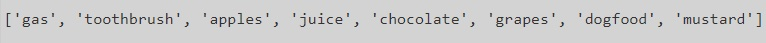

..  Copyright (C)  Celine Latulipe.  Permission is granted to copy, distribute
    and/or modify this document under the terms of the GNU Free Documentation
    License, Version 1.3 or any later version published by the Free Software
    Foundation; with Invariant Sections being Forward, Prefaces, and
    Contributor List, no Front-Cover Texts, and no Back-Cover Texts.  A copy of
    the license is included in the section entitled "GNU Free Documentation
    License".

Week 9 Lab
==========

.. admonition:: Material Covered

   Sequences (Chapter 9)

Level 1
-------

In this level you will combine two lists and remove all the double entries. The starter code below gives you two lists. Follow the steps (all of your code can go inside main()).

#. Create a new list called temp_list and fill it with all the elements from the two provided lists (hint: use '+').
#. Create another new list called final_list and set it to empty.
#. Iterate through temp_list, and for each item, check to see if that item is in final_list, if not, add it to final_list (hint: use append to add the item to final_list).

#. Print out the final list to the console to check the output.

Your output should look like this:

.. activecode:: lab9_level1
       
    ################################################################
    # Student name, ID & lab section
    # Date
    # Lab 9, Level 1
    ################################################################
    
    def main():
        norms_list = ["gas", "toothbrush", "apples", "juice", "chocolate"]
        anitas_list = ["apples", "grapes", "dog food", "gas", "mustard"]

    main()

Level 2
-------

In this level you are given a jumbled string that you must decode to reveal the hidden message. The starter code below gives you a main function, with a coded message string already provided. 

#. Define a decoder function that accepts a string input and returns a string output. Make sure you add type annotation for this function. The steps below tell you what to put inside this function. For now just print out and then return the string that is passed in. Call this function from main. Your main function and output should look like this:

2. Inside your decoder function, start by reversing the string so that the last character of the string becomes the first, the second last character becomes the second and so on. Reversing a string can be done using the slice operator with [::-1] as the slicing information. Inside your function, print the resulting string after reversing to ensure the reversal has worked.

3. Inside the function, split the message using 'v' as the delimiter, saving the result to a temporary list variable. Print out this list to ensure that you have this working. 
  
4. Create a new variable called space and set it equal to a blank space. Now, join the list back together into a string using the newly created space variable. Save the result of this join to a new variable. Print out this joined message to make sure that you have a single string that looks like this:

5. Using a for loop, iterate through each character in the joined message. If the character is a 'b' swap it out with an 's'. The image below demonstrates how to swap out a character in a string using the index() operator, slices and concatenation.

6. Return the final decoded message. Your output, including all the temporary decodings, should look like this:

.. image:: Figures/Lab9_Level2_final.jpg
   :width: 500
   :align: center

.. activecode:: lab9_level2
    
    ################################################################
    # Student name, ID & lab section
    # Date
    # Lab 9, Level 2
    ################################################################
   

    def main():
        message = "tnedutbvbuoidutbvavekilvgniydutbvtratb"

    main()  

Level 3
-------
In this level you will add some functionality to the poetry analyzer code below. 

Run this code right now. The main() function reads in a poem, and then prints out the title. Warning: the spoken word poem that is read in on line 14 has explicit words in it - if you find the F-word offensive, you should use the other poem by commenting out line 14 and uncommenting line 18.

You can look at the two poem text files at the bottom of this page. 

Your job is to add functions and uncomment the code in main() that calls those functions. Follow the instructions below the code window.

.. activecode:: ac_lab9_level3
   :available_files: ManUp_10Responses.txt
   

   ################################################################
   # Student name, ID & lab section
   # Date
   # Lab 9, Level 3
   ################################################################

   def extract_title(poem):
       # return the title (words before 'by')
       first_line_split = poem[0].split("by")
       return first_line_split[0]
   
   def main():
       poem_file_name = "ManUp_10Responses.txt"
       # if you don't want to use the ManUp poem, which has explicit language in it,
       # you can use the poem instead, by commenting out the line above, and uncommenting
       # the line below
       #poem_file_name = "FlandersFields.txt"
        
       fileref =  open(poem_file_name, "r")
       lines_list = fileref.readlines()

       title = extract_title(lines_list)
       print("The title of the poem is: ", title)

       #author = extract_author(lines_list)
       #print("The author of the poem is: ", author)

       #poem_body = extract_poem_body(lines_list)
       #for line in poem_body:
       #    print(line)
       #    print()

       #average_words = calc_avg_words_per_line(poem_body)
       #print("There are ", average_words, "average words per line in the poem.")
        
       #search_word = input("What word do you want to count in the poem? ")
        
       #num_occurences = count_word(poem_body, search_word)
       #print("The word ", search_word, "occurs ", num_occurences, "times in the poem")

   main()

#. First follow the example of the extract title function and create a function that will extract and return the author's name. The author's name will be on the first line of the file (both poetry files have <title> by <author> as the first line of the file. When you have this working, test it by uncommenting out the two lines in main() that call the extract_author function and print out the result. 

#. Next, add an extract_poem_body function. The poem files have the author and title on the first line of the text file and the URL source of the poem on the second line. We need a list of poetry lines that exclude these two. Inside the function use slicing on the list of poetry lines to get a list that excludes the first two lines. Return this smaller *list* of poetry lines. Again, test to make sure this works, by uncommenting the lines in main() that call this function and print out the poem (including the for loop). 

#. Now, define a calc_avg_words_per_line function. This function should loop through the lines of the poem and count how many words are in each line. Atfer looping through all the lines, calculate the average and return it. Test this function by uncommenting the lines in main(). For the 10 responses poem, the average words per line should be 44.4. For the Flanders Fields poem, the average words per line should be 7.6111.

#. The last thing to add is a count_word function. This function should take in the poem and a word, and then return the number of times the word is found in the poem. There are a couple of different ways to do this, keeping in mind that the poem is passed in as a list of lines. In the main() function, uncomment the lines that ask the end user for a search word and then call the count_word() function and prints out the result. 

.. datafile:: ManUp_10Responses.txt

    10 Responses to the Phrase "Man Up" by Kyle "Guante" Tran Myhre
    Source: "A Love Song, A Death Rattle, A Battle Cry" Kyle "Guante" Tran Myhre, Button Poetry, 2016. Also online: https://guante.info/2012/02/07/10-responses-to-the-phrase-man-up-spoken-word/ 
    1. Fuck you.
    2. If you want to question my masculinity, like a schoolyard circle of curses, like a swordfight with lightsaber erections, save your breath. Because contrary to what you may believe, not every problem can be solved by “growing a pair.” You can’t arm-wrestle your way out of depression. The CEO of the company that just laid you off does not care how much you bench. And I promise, there is no lite beer in the universe full-bodied enough to make you love yourself.
    3. Man up? Oh that’s that new superhero, right? Mild-mannered supplement salesman Mark Manstrong says the magic words “MAN UP,” and then transforms into THE FIVE O’CLOCK SHADOW, the massively-muscled, deep-voiced, leather-duster-wearing super-man who defends the world from, I don’t know, feelings.
    4. Of course. Why fight to remove our chains, when we can simply compare their lengths? Why step outside the box, when the box has these bad-ass flame decals on it? We men are cigarettes: dangerous, and poisonous, and stupid.
    5. You ever notice how nobody ever says “woman up?” They just imply it. Because women and the women’s movement figured out a long time ago that being directly ordered around by commercials, magazines and music is dehumanizing. When will men figure that out?
    6. The phrase “Man Up” suggests that competence and perseverance are uniquely masculine traits. That women—not to mention any man who doesn’t eat steak, drive a pickup truck, have lots of sex with women—are nothing more than background characters, comic relief, props. More than anything, though, it suggests that to be yourself—whether you wear skinny jeans, listen to Lady Gaga, rock a little eyeliner, drink some other brand of light beer, or write poetry—will cost you.
    7. How many boys have to kill themselves before this country acknowledges the problem? How many women have to be assaulted? How many trans people have to be murdered? We teach boys how to wear the skin of a man, but we also teach them how to raise that skin like a flag and draw blood for it.
    8. Boy babies get blue socks. Girl babies get pink socks. What about purple? What about orange, yellow, chartreuse, cerulean, black, tie-dyed, buffalo plaid, rainbow…
    9. I want to be free, to express myself. Man up. I want to have meaningful, emotional relationships with my brothers. Man up. I want to be weak sometimes. Man up. I want to be strong in a way that isn’t about physical power or dominance. Man up. I want to talk to my son about something other than sports. Man up. I want to be who I am. Man up.
    10. No.
        

.. datafile:: FlandersFields.txt

       In Flanders Fields by John McCrae
    Source: https://www.poetryfoundation.org/poems/47380/in-flanders-fields, written in 1918. Public Domain.
     In Flanders fields the poppies blow
    Between the crosses, row on row,
        That mark our place; and in the sky
        The larks, still bravely singing, fly
    Scarce heard amid the guns below.
    We are the Dead. Short days ago
    We lived, felt dawn, saw sunset glow,
        Loved and were loved, and now we lie,
            In Flanders fields.
    Take up our quarrel with the foe:
    To you from failing hands we throw
        The torch; be yours to hold it high.
        If ye break faith with us who die
    We shall not sleep, though poppies grow
            In Flanders fields.
