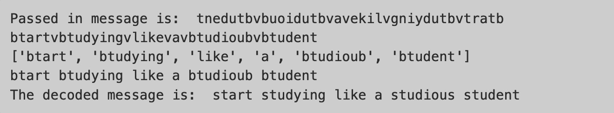

..  Copyright (C)  Celine Latulipe.  Permission is granted to copy, distribute
    and/or modify this document under the terms of the GNU Free Documentation
    License, Version 1.3 or any later version published by the Free Software
    Foundation; with Invariant Sections being Forward, Prefaces, and
    Contributor List, no Front-Cover Texts, and no Back-Cover Texts.  A copy of
    the license is included in the section entitled "GNU Free Documentation
    License".

Week 9 Lab
==========

.. admonition:: Material Covered

   Sequences (Chapter 9)

Level 1
-------

In this level you will combining two lists and remove all the double entries. The starter code below gives you two lists. Follow the steps (all of your code can go inside main()).

#. Create a new list called temp_list and fill it with all the elements from the two provided lists (hint: use '+').
#. Create another new list called final_list and set it to empty.
#. Iterate through temp_list, and for each item, check to see if that item is in final_list, if not, add it to final_list (hint: use append to add the item to final_list).

#. Print out the final list to the console to check the output.

Your output should look like this:

.. image:: Figures/Lab9_Level1_output.jpg
   :width: 600
   :align: center

.. activecode:: lab9_level1
       
    ################################################################
    # Student name, ID & lab section
    # Date
    # Lab 9, Level 1
    ################################################################
    
    def main():
        norms_list = ["gas", "toothbrush", "apples", "juice", "chocolate"]
        anitas_list = ["apples", "grapes", "dog food", "gas", "mustard"]

    main()

Level 2
-------

In this level you will be given a jumbled string that you must decode to reveal the hidden message.

#. Start by reversing the string, that is the last character of the string should become the first, the second last should become the second and so on. Hint: this should only take one line of code, there's a handy trick to doing this using slices.

#. Create a new variable called space and set it equal to a blank space. Now split the message using 'v' as the delimiter then on a new line, join the message back together using the newly created space variable. Your message string should now look like this:

.. image:: Figures/Lab9_Level2_partway.jpg
   :width: 300
   :align: center

#. Using a for loop, iterate through each character in message. If the character is a 'b' swap it out with an 's'. Hint: Actually swapping out the character only needs one line of code, use slices!

#. Print out message. Your output should look like this:

.. activecode:: lab9_level2
    
    ################################################################
    # Student name, ID & lab section
    # Date
    # Lab 9, Level 2
    ################################################################
   

    def main():
        message = "tnedutbvbuoidutbvavekilvgniydutbvtratb"

    main()  

Level 3
-------
In this level you will
.. activecode:: lab9_level3   

    ################################################################
    # Student name, ID & lab section
    # Date
    # Lab 9, Level 3
    ################################################################

